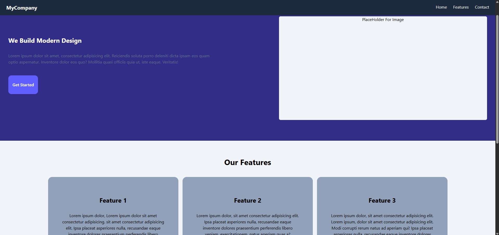
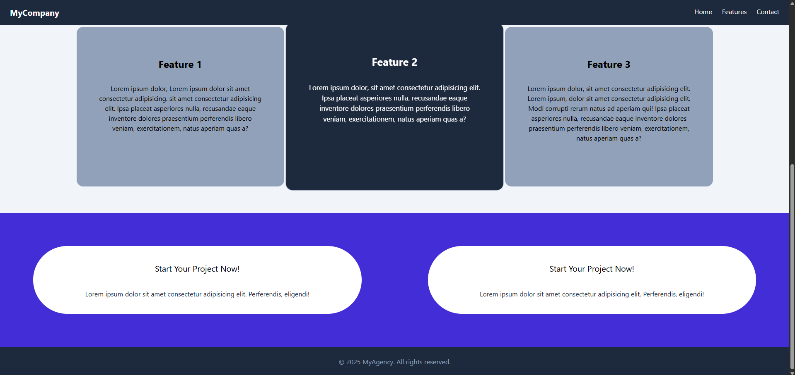

# Tailwind Css + React 
# Basic Template

A simple yet useful starter for learning both React in terms of components and styling in terms of Tailwindcss
---

## Demo / Preview

<!-- Add a screenshot, video, or link to live demo -->
  
  

## Tech Stack

React
tailwindcss
---

### Installation of Vite and Tailwindcss

# Create React App
npm create vite@latest (Your Project Name)
cd (Your Project Name)
npm install

# Installation of Tailwindcss
 npm install tailwindcss @tailwindcss/vite

# Changes Needed for Installation of Tailwindcss in React app
 Go to vite.config.js
 import tailwindcss from "@tailwindcss/vite"

# Final Importing
import { defineConfig } from 'vite'
import react from '@vitejs/plugin-react'
import tailwindcss from "@tailwindcss/vite"
// https://vite.dev/config/
export default defineConfig({
  plugins: [react(),tailwindcss()],
})

Now Go to index.css and @import "tailwindcss";

You will get the things work out. If you are still having problem with this method Reach Me at my instagram - __adityakalra